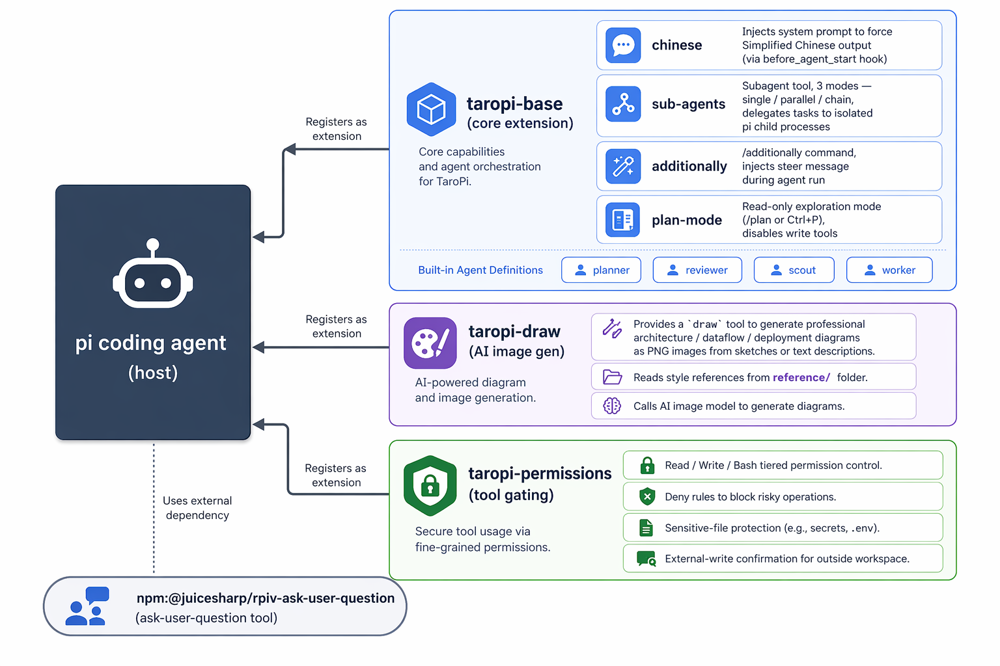

# TaroPi

[English](./README.en.md) | [简体中文](./README.md)

A personal collection of [pi coding agent](https://pi.dev) extensions (monorepo).

## Architecture



## Recommended Setup

Before installing, copy the config files as described in [`recommend/README.md`](./recommend/README.md).

## Install

```bash
# One-liner to install all extensions (including external deps)
pi install ./taropi-base \
  && pi install ./taropi-permissions \
  && pi install ./taropi-draw \
  && pi install npm:@juicesharp/rpiv-ask-user-question
```

Or manually add to `~/.pi/agent/settings.json`:

```json
{
  "packages": [
    "/path/to/TaroPi/taropi-base",
    "/path/to/TaroPi/taropi-permissions",
    "/path/to/TaroPi/taropi-draw",
    "npm:@juicesharp/rpiv-ask-user-question"
  ]
}
```

Run `/reload` or restart pi after installation.

## Bundled Extensions

| Package | Description |
|---------|-------------|
| `taropi-base` | Core: Chinese response + debugger/developer sub-agents |
| `taropi-permissions` | Tool permission control: read/write/bash gating, sensitive file protection |
| `taropi-draw` | AI image generation: generate professional architecture diagrams (PNG) from sketches or descriptions |

## External Dependencies

| Package | Description |
|---------|-------------|
| [rpiv-ask-user-question](https://www.npmjs.com/package/@juicesharp/rpiv-ask-user-question) | Ask user questions |


