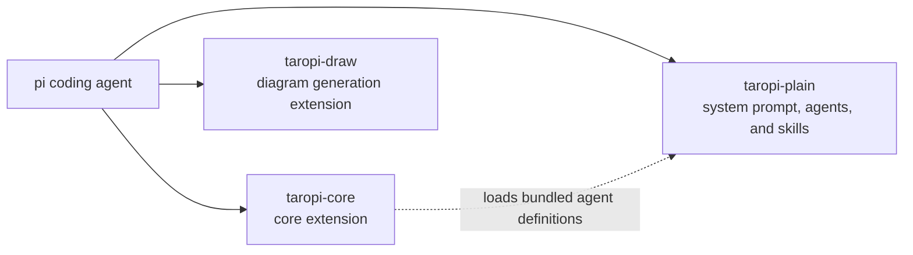

# TaroPi

[English](./README.en.md) | [简体中文](./README.md)

A personal collection of [pi coding agent](https://pi.dev) extensions (monorepo).

## Architecture


```mermaid
flowchart LR
  PI[pi coding agent]
  CORE[taropi-core\ncore extension]
  DRAW[taropi-draw\ndiagram generation extension]
  PLAIN[taropi-plain\nsystem prompt, agents, and skills]

  PI --> CORE
  PI --> DRAW
  PI --> PLAIN
  CORE -.loads bundled agent definitions.-> PLAIN
```

## Recommended Setup

Before installing, copy the config files as described in [`taropi-plain/recommend/README.md`](./taropi-plain/recommend/README.md).

## Install

```bash
pi install ./
```

Or manually add to `~/.pi/agent/settings.json`:

```json
{
  "packages": [
    "/path/to/TaroPi"
  ]
}
```

Run `/reload` or restart pi after installation.

## Bundled Extensions

| Package | Description |
|---------|-------------|
| `taropi-core` | Core: subagent tools, permission control, Chinese response, web access, etc. |
| `taropi-draw` | AI image generation: generate professional architecture diagrams (PNG) from sketches or descriptions |
| `taropi-plain` | Plain-text resources: append system prompt, subagent definitions, skills, and recommended configuration |


