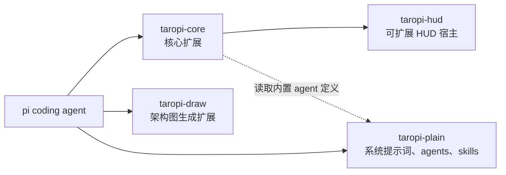

# TaroPi

[简体中文](./README.md) | [English](./README.en.md)

个人 [pi coding agent](https://pi.dev) 扩展集合 (Monorepo)。

## 整体架构



## 推荐配置

安装插件前，先按 [`taropi-plain/recommend/README.md`](./taropi-plain/recommend/README.md) 的说明将配置文件复制到对应位置。

## 全局角色文本（PREAMBLE.md）

[`taropi-plain/PREAMBLE.md`](./taropi-plain/PREAMBLE.md) 是 `taropi-core` 的全局角色文本模板。手动复制到 Pi 配置目录的 `PREAMBLE.md` 后，启动 Pi 或执行 `/reload` 时由 `taropi-core` 读取：

```bash
mkdir -p ~/.pi/agent
cp taropi-plain/PREAMBLE.md ~/.pi/agent/PREAMBLE.md
```

`PREAMBLE.md` 是 **TaroPi 扩展约定**，不是 Pi 原生提示词文件。它只替换系统提示词开头的角色文本；Pi 仍会按当前启用工具动态生成工具摘要和规则，并继续注入 Pi 文档指引、skills、`AGENTS.md` 项目上下文、当前工作目录和 `APPEND_SYSTEM.md`。

配置目录遵循 Pi 的 `PI_CODING_AGENT_DIR` 环境变量，未设置时为 `~/.pi/agent/`。文件由用户手动维护，TaroPi 不会自动创建；修改后重启 Pi 或执行 `/reload` 生效。

### 与完整提示词覆盖的优先级

Pi 原生完整覆盖优先于 PREAMBLE：受信任项目的 `.pi/SYSTEM.md`、全局 `~/.pi/agent/SYSTEM.md`、`--system-prompt` 或其他扩展设置的强制提示词生效时，`taropi-core` 会跳过 PREAMBLE 替换并提示冲突。这样子 Agent 和其他专用角色可以保持完整覆盖行为。

`APPEND_SYSTEM.md` 用于在系统提示词末尾追加规则，和 PREAMBLE 可以同时使用。若要恢复 Pi 默认角色，只需移走或清空 `~/.pi/agent/PREAMBLE.md` 后执行 `/reload`：

```bash
mv ~/.pi/agent/PREAMBLE.md ~/.pi/agent/PREAMBLE.md.backup
```

### Pi 默认角色文本参考

未配置 PREAMBLE 时，Pi 的默认前导角色文本为：

```text
You are an expert coding assistant operating inside pi, a coding agent harness. You help users by reading files, executing commands, editing code, and writing new files.
```

其后的工具摘要、规则、文档指引、skills、项目上下文和当前工作目录均由 Pi 在运行时动态生成。


## 安装

```bash
# 一条命令搞定
pi install git:git@github.com:Veni222987/TaroPi.git
```

pi 会自动 clone 仓库并运行 `npm install`，`ask_user_question` 等所有依赖全部就位。

也可手动写入 `~/.pi/agent/settings.json`：

```json
{
  "packages": [
    "git:git@github.com:Veni222987/TaroPi.git"
  ]
}
```

安装后 `/reload` 或重启 pi 即可生效。

## 内置扩展

| 包 | 说明 |
|----|------|
| `taropi-core` | 核心整合包：全局 PREAMBLE 角色替换、subagent 工具、权限管控、网络访问、向用户提问等；中文表达规则按推荐的 `APPEND_SYSTEM.md` 配置启用 |
| `taropi-draw` | AI 生图：根据手绘草图或描述生成专业架构图 (PNG) |
| `taropi-hud` | 可扩展 HUD 宿主：基础状态面板、`/hud-fresh` 和外部子版块开发接口 |
| `taropi-plain` | 纯文本资源目录：PREAMBLE、追加系统提示词、agents、skills 和推荐配置 |

<!-- test-passed: 2026 -->
