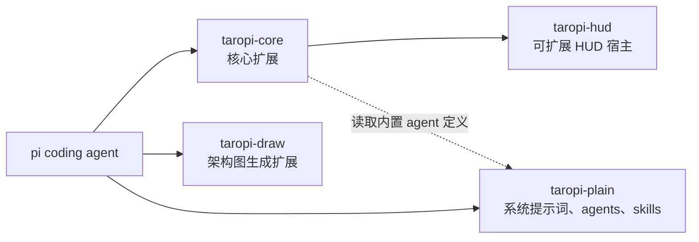

# TaroPi

[简体中文](./README.md) | [English](./README.en.md)

个人 [pi coding agent](https://pi.dev) 扩展集合 (Monorepo)。

## 整体架构



## 推荐配置

安装插件前，先按 [`taropi-plain/recommend/README.md`](./taropi-plain/recommend/README.md) 的说明将配置文件复制到对应位置。

## 安装

```bash
# 一条命令搞定
pi install git:git@github.com:Veni222987/TaroPi.git
```

pi 会自动 clone 仓库并运行 `npm install`，`ask_user_question` 等所有依赖全部就位。

也可手动写入 `~/.pi/agent/settings.json`：

```json
{
  "packages": [
    "git:git@github.com:Veni222987/TaroPi.git"
  ]
}
```

安装后 `/reload` 或重启 pi 即可生效。

## 内置扩展

| 包 | 说明 |
|----|------|
| `taropi-core` | 核心整合包：subagent 工具、权限管控、网络访问、向用户提问等；中文表达规则按推荐的 `APPEND_SYSTEM.md` 配置启用 |
| `taropi-draw` | AI 生图：根据手绘草图或描述生成专业架构图 (PNG) |
| `taropi-hud` | 可扩展 HUD 宿主：基础状态面板、`/hud-fresh` 和外部子版块开发接口 |
| `taropi-plain` | 纯文本资源目录：追加系统提示词、sub-agent 定义、skills 和推荐配置 |

<!-- test-passed: 2026 -->
